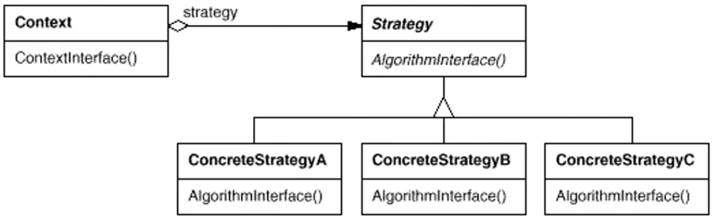

<p style="text-align: center;">设计模式学习笔记（李建忠视频笔记）</p>

- [1. 设计模式简介](#1-设计模式简介)
  - [1.1. 课程目标：](#11-课程目标)
  - [1.2. 什么是设计模式：](#12-什么是设计模式)
  - [1.3. Gang of Four 设计模式](#13-gang-of-four-设计模式)
  - [1.4. 从面向对象谈起](#14-从面向对象谈起)
  - [1.5. 深入理解面向对象](#15-深入理解面向对象)
  - [1.6. 软件设计固有复杂性](#16-软件设计固有复杂性)
  - [1.7. 软件设计复杂的根本原因](#17-软件设计复杂的根本原因)
  - [1.8. 如何解决复杂性](#18-如何解决复杂性)
  - [1.9. 软件设计的目标](#19-软件设计的目标)
- [2. 面向对象设计原则](#2-面向对象设计原则)
  - [2.1. 面向对象设计，为什么？](#21-面向对象设计为什么)
  - [2.2. 重新认识面向对象](#22-重新认识面向对象)
  - [2.3. 面向对象设计的8大原则](#23-面向对象设计的8大原则)
  - [2.4. 面向接口设计](#24-面向接口设计)
  - [2.5. 将设计原则提升为设计经验](#25-将设计原则提升为设计经验)
- [3. 模板方法](#3-模板方法)
  - [3.1. GOF-23种设计模式的分类](#31-gof-23种设计模式的分类)
  - [3.2. 从分装变化角度对模式分类](#32-从分装变化角度对模式分类)
  - [3.3. 重构获得模式 Refactorying to Patterns](#33-重构获得模式-refactorying-to-patterns)
  - [3.4. 重构关键技法](#34-重构关键技法)
  - [3.5. “组件协作”模式](#35-组件协作模式)
    - [3.5.1. Template Method 模板方法](#351-template-method-模板方法)
      - [3.5.1.1. 动机（Motivation）](#3511-动机motivation)
      - [3.5.1.2. 结构（Structure）](#3512-结构structure)
      - [3.5.1.3. 要点总结](#3513-要点总结)
    - [3.5.2. Strategy 策略模式](#352-strategy-策略模式)
      - [3.5.2.1. 动机（Motivation）](#3521-动机motivation)
      - [3.5.2.2. 模式定义](#3522-模式定义)
      - [3.5.2.3. 结构（Structure）](#3523-结构structure)
      - [3.5.2.4. 要点总结](#3524-要点总结)
    - [3.5.3. Observer/Event 观察者模式](#353-observerevent-观察者模式)
      - [3.5.3.1. 动机（Motivation）](#3531-动机motivation)
      - [3.5.3.2. 模式定义](#3532-模式定义)
      - [3.5.3.3. 结构（Structure）](#3533-结构structure)
  - [3.6. “单一职责”模式](#36-单一职责模式)
    - [3.6.1. Decorator 装饰模式](#361-decorator-装饰模式)
      - [3.6.1.1. 动机（Motivation）](#3611-动机motivation)
      - [3.6.1.2. 模式定义](#3612-模式定义)
      - [3.6.1.3. 结构（Structure）](#3613-结构structure)
      - [3.6.1.4. 要点总结](#3614-要点总结)


## 1. 设计模式简介

### 1.1. 课程目标：
- 理解松耦合设计思想
- 掌握面向对象设计原则
- 掌握重构技法改善设计
- 掌握GOF核心设计模式

### 1.2. 什么是设计模式：
“每一个模式描述了一个在我们周围不断重复发生的问题以及该问题的解决方案的核心。这样，你就能一次又一次地使用该方案而不必做重复劳动” 
                          - Christopher Alexand

### 1.3. Gang of Four 设计模式
- 《设计模式：**可复用面向对象**软件的基础》
    - **可复用**是设计模式的目标
    - **面向对象**是设计模式的手法
    - 这本书定义了23种面向对象的设计模式

### 1.4. 从面向对象谈起
面向对象包含两个思维模型：
- 程序员与计算机之间的沟通称之为**底层思维**：向下，如何把握机器底层从微观理解对象构造，帮助程序员建立机器模型
    - 语言构造
    - 编译转换
    - 内存模式
    - 运行时机制
- 抽象思维：向上，如何将我们的周围世界抽象为程序代码
    - 面向对象
    - 组件封装
    - 设计模式
    - 架构模式

### 1.5. 深入理解面向对象
- 向下：深入理解三大面向对象机制
    - 封装，隐藏内部实现
    - 继承，复用现有代码
    - 多态，改写对象行为
- 向上：深刻把握面向对象机制所带来的抽象意义，理解如何使用这些机制来表达现实世界，掌握什么是“好的面向对象设计”。评判这个设计的标准要靠抽象思维。

### 1.6. 软件设计固有复杂性
建筑商从来不会去想给一栋已经建好的100层高的楼房底下再新修一个小地下室--这样做花费极大而且注定要失败。而且令人惊奇的是，软件系统的用户在要求作出类似改变时却不会仔细考虑，而且他们认为这只是需要简单编程的事。 -- Grady Booch

### 1.7. 软件设计复杂的根本原因
- 客户需求的变化
- 技术平台的变化
- 开发团队的变化
- 市场环境的变化

### 1.8. 如何解决复杂性
人类解决问题一般有两种思维模型
1. **分解**：
    - 人们面对复杂性有一个常见的做法：分而治之，大问题分解为多个小问题，复杂的分解为多个简单的。
2. **抽象**：
    - 解决更高层次的来讲，人们处理复杂性有一种通用的技术叫抽象。由于不能掌握全部的复杂对象，人们选择忽视它的非本质细节，而去处理泛化和理想化后的对象模型。
    <details><summary>Shape.h</summary>
    <div>
    
    ```cpp
    class Shape{
    public:
        // 纯虚函数/抽象函数
        virtual void Draw(const Graphic& g) = 0;
        // 虚的析构函数。子类以后通过多态释放的时候，子类的析构函数才会被正确的调用到
        virtual ~Shape(){}
    }
    class Point{ //辅助类型
    public:
        int x;
        int y;
    }
    class Line: public Shape{ //Line继承Shape。C加加中绝大多数的继承都用public
    public:
        Point start;
        Point end;
        //构造器
        Line(const Point& start, const Point& end){
            this->start = start;
            this->end = end;
        }
        //Overwrite父类的虚函数，实现自己的Draw，负责画自己。
        virtual void Draw(const Graphics& g){
            g.DrawLine(Pens.Red, start.x, start.y, end.x, end.y);
        }
    }
    class Rect: public Shape{
    public:
        Point leftUp;
        int width;
        int height;
        //构造器
        Rect(const Point& leftUp, int width, int height){
            this->leftUp = leftUp;
            this->width = width;
            this->height = height;
        }
        //实现自己的Draw，来画自己
        virtual void Draw(const Graphics& g){
            g.DrawRectangle(Pens.Red, leftUp, width, height);
            }
    }
    ```
    </div>
    </details>

    <details><summary>MainForm.cpp</summary>
    <div>  

    ```cpp
    MainForm.cpp
    class MainForm: public Form{
    private:
        Point p1;
        Point p2;
        //针对所有形态，可以插入Line，Rect类型。为了支持多态性所以需要用指针
        vector<Shape*> shapeVector;
    public:
        MainForm(){
            //...
        }
    protected:
        virtual void OnMouseDown(const MouseEventArgs& e);
        virtual void OnMouseUp(const MouseEventArgs& e);
        virtual void OnPaint(const MouseEventArgs& e);
    }
    void MainForm::OnMouseDown(const MouseEventArgs& e){
        p1.x = e.X;
        p1.y = e.Y;
        if(rdoLine.Checked){
            shapeVector.push_back(new Line(p1,p2));//因为shapeVector是指针，所以要new一个堆对象指针。之后一定要Delet
        }
        else if (rdoRect.Checked){
            int width = abs(p2.x - p1.x);
            int height = abs(p2.y - p1.y);
            shapeVector.push_back(new Rect(p1, width, height));
        }

        //...
        this->Refresh();
        Form::OnMouseUp(e);
    }
    void MainForm::OnPain(const PaintEventArgs& e){
        //针对所有形状
        for(int i=0; i<shapeVector.size(); i++){
            //直接对shape的所有形状调用Draw。Draw是虚函数，所以是多态调用，各负其责。例：如果存储的Line的话，找Line的Draw调用DrawLine
            shapeVector[i]->Draw(e.Graphics);//接口一样
        }
        Form::OnPaint(e);
    }
    ```
    </div>
    </details>

### 1.9. 软件设计的目标
什么是好的软件设计？软件设计的金科玉律：**复用**。所有设计模式的目标就是复用性。（这里的复用指的是二进制编译单位意义的复用，而不是源代码片段复用）

## 2. 面向对象设计原则
### 2.1. 面向对象设计，为什么？
变化是复用的天敌！面向对象设计最大的优势在于：**抵御变化！**
### 2.2. 重新认识面向对象
- 理解隔离变化（从抽象思维来理解）
    - 从宏观层面来看，面向对象的构建方式更能适应软件的变化，能将变化所带来的影响减为最小。
- 各司其职
    - 从微观层面看，面向对象的方式更强调各个类的“责任”
    - 由于需求变化导致的新增类型不应该影响原来类型的实现
- 对象是什么？
    - 从语言实现层面来看，对象封装了代码和数据。
    - 从规格层面来看，对象是一系列可被使用的公共接口。
    - 从概念层面俩看，对象是某种拥有责任的抽象。
### 2.3. 面向对象设计的8大原则
设计原则比设计模式更重要，有了原则可以创造自己的模式。错误观点：不要把模式当作算法来学习
1. 依赖倒置原则（DIP）
    - 高层模块（稳定）不应该依赖于低层模块（变化），二者都应该依赖于抽象（稳定）。
    - 抽象（稳定）不应该依赖于实现细节（变化），实现细节应该依赖于抽象（稳定）。
2. 开放封闭原则（OCP）
    - 对扩展开放，对更改封闭。
    - 类模块应该是可扩张的，但是不可修改。
3. 单一职责原则（SRP）
    - 一个类应该仅有一个引起它变化的原因。
    - 变化的方向隐含着类的责任。
4. Liskov替换原则（LSP）
    - 子类必须能够替换他们的基类（IS-A）
    - 继承表达类型抽象。
5. 接口隔离原则（ISP）
    - 不应该强迫客户程序（调用程序）以来它们不用的方法。
    - 接口应该小而完备。（不要把不必要的方法Public出去）
6. 优先使用对象组合，而不是类继承（继承关系就是类属关系）
    - 类继承通常为“白箱复用”，对象组合通常为“黑箱复用”。
    - 继承在某种程度上破坏了封装性，子类父类耦合度过高。
    - 而对象组合则只要求被组合的对象具有良好定义的接口，耦合度低。
7. 封装变化点（封装代码和数据）
    - 使用封装来创建对象之间的分界层，让设计者可以在分界层的一侧进行修改，而不会对另一侧产生不良的影响，从而实现两者之间的松耦合。
8. 针对接口编程，而不是针对实现编程
    - 不将变量类型声明为某个特定的具体类（业务类型），而是声明某个接口。
    - 客户程序无需获知对象的具体类型，只需要知道对象所具有的接口。
    - 减少系统中各部分的依赖关系，从而实现“高内聚，松耦合”的类型设计方案。
### 2.4. 面向接口设计
**接口标准化**是产业强盛的标志
- 以史为鉴
    1. 秦为什么能够统一六国？：秦的武器都有统一的标准，而其他六国不是。
    2. 雕版印刷：紧耦合设计，字与字没法分离。活字印刷：松耦合设计。
### 2.5. 将设计原则提升为设计经验
1. 设计习语 Design Idioms：描述与特定编程语言相关的底层模式，技巧惯用法。
2. 设计模式 Design Patterns：主要描述的是“类与相互通信的对象之间的组织关系，包括它们的角色，职责，协作方式等方面。
3. 架构模式 Architectural Patterns：描述系统中与基本结构组织关系密切的高层模式，包括子系统划分，职责，以及如何组织它们之间关系的规则。
   
[关于对设计模式说明的网站](https://refactoringguru.cn/design-patterns)

## 3. 模板方法
### 3.1. GOF-23种设计模式的分类

- 从目的分类：
  - 创建型模式：将对象的部分创建工作延迟到子类或者其他对象，从而应对需求变化为对象创建时具体类型实现引来的冲击。（主要解决对象创建的工作）
  - 结构型模式：通过类继承或者对象组合获得更灵活的结构，从而应对需求变化为对象的结构带来的冲击。（主要解决对象在需求变化的时候对对象结构的冲击）
  - 行为型模式：通过类继承或者对象组合来划分 类与对象间的职责，从而应对需求变化为多个交互的对象带来 的冲击。（对个类之间的交互过程中责任的划分）
- 从范围分类：
  - 类模式处理类与子类的静态关系
  - 对象模式处理对象间的动态关系
### 3.2. 从分装变化角度对模式分类
|           组件协作           |       对象性能        |              数据结构               |        单一职责         |        接口隔离        |       行为变化        |           对象创建           |       状态变化        |         领域问题          |
| :--------------------------: | :-------------------: | :---------------------------------: | :---------------------: | :--------------------: | :-------------------: | :--------------------------: | :-------------------: | :-----------------------: |
| Template Method（模板方法）  | Singleton（单件模式） |        Composite（组合模式）        | Decorator（装饰器模式） |   Facade（门面模式）   | Command（命令行模式） |  Factory Method（工厂方法）  | Memento（备忘录模式） | Interpreter（解析器模式） |
|     Strategy（策略模式）     | Flyweight（享元模式） |       Iterator（迭代器模式）        |   Bridge（桥接模式）    |   Proxy（代理模式）    | Visitor（访问器模式） | Abstract Factory（抽象工厂） |   State（状态模式）   |                           |
| Observer/Event（观察者模式） |                       | Chain of Reposibility（职责链模式） |                         | Mediator（中介者模式） |                       |    Prototype（原型模式）     |                       |                           |
|                              |                       |                                     |                         | Adapter（适配器模式）  |                       |    Builder（ 构建器模式）    |                       |                           |

### 3.3. 重构获得模式 Refactorying to Patterns
- 面向对象设计模式是“好的面向对象设计”，所谓“好的面向对象设计”指是那些可以满足“应对变化，提高复用”的设计。
- 现代软件设计的特征是“需求的频繁变化”设计模式的要点是“寻找变化点，然后在变化点处应用设计模式，从而来更好地应对需求的变化”.“什么时候、什么地点应用设计模式”比“理解设计模式结构本身”更为重要
- 设计模式的应用不宜先入为主，一上来就使用设计模式是对设计模式的最大误用。没有一步到位的设计模式。敏捷软件开发实践提倡的 “Refactoring to Patterns” 是目前普遍公认的最好的使用设计模式的方法。

### 3.4. 重构关键技法
从不同角度看同一问题
- 静态->动态  
- 早绑定->晚绑定  
- 继承->组合  
- 编译时依赖->运行时依赖  
- 紧耦合->松耦合 
  
### 3.5. “组件协作”模式
- 现代软件专业分工之后的第一个结果是 “框架与应用程序的划分”，“组件协作” 模式通过晚期绑定，来实现框架与应用程序之间的松耦合，是二者之间协作时常用的模式。
- 典型模式：
  - Template Method
  - Observer / Event
  - Strategy
#### 3.5.1. Template Method 模板方法
##### 3.5.1.1. 动机（Motivation）
- 在软件构建过程中，对于某一项任务，它常常有**稳定**的整体操作结构，但各个子步骤却有很多**改变**的需求，或者由于固有的原因（比如框架与应用之间的关系）而无法和任务的整体结构同时实现。 
- 如何在确定**稳定操作**结构的前提下，来灵活应对各个子步骤的**变化或者晚期**实现需求？
  结构化软件设计流程：早绑定Application（晚）调用Library（早）
  Library开发人员：（1）开发1,3,5三个步骤
  <details><summary>template1_lib.cpp</summary>
  <div>

  ```cpp
  //程序库开发人员
  class Library{
  public:
      void Step1(){
          //...
      }
      void Step3(){
          //...
      }
      void Step5(){
          //...
      }
  };
  ```
  </div>
  </details>
  
  Application开发人员：（1）开发2，4两个步骤（2）程序主流程
  <details><summary>template1_app.cpp</summary>
  <div>

  ```cpp
  //应用程序开发人员
  class Application{
  public:
      bool Step2(){
          //...
      }
      void Step4(){
          //...
      }
  };
  int main(){
      Library lib();
      Application app();

      lib.Step1();

      if(app.Step2())
          lib.Step3();
      for(int i{};i<4;i++){
          app.Step4();
      }
      lib.Step5();
  }
  ```
  </div>
  </details>

  面向对象软件设计流程：晚绑定Library（早）调用Application（晚）
  Library开发人员：（1）开发1,3,5三个步骤（2）程序主流程
  <details><summary>template2_lib.cpp</summary>
  <div>

  ```cpp
  //程序库开发人员
  class Library{
  public:
  //稳定 template method 的算法骨架，程序主流程
      void Run(){
          Step1();
          if(Step2()){//支持变化->虚函数的多态调用
              Step3();
          }
          for (int{};i<4;i++){
              Step4();//支持变化->虚函数的多态调用
          }
          Step5();
      }
      virtual ~Library(){}

  protected:
      void Step1(){//稳定->非虚函数
          //...
      }
      void Step3(){//稳定
          //...
      }
      void Step5(){//稳定
          //...
      }
      //纯虚函数
      virtual bool Step2() = 0; //变化
      virtual void Step4() = 0; //变化
  };
  ```
  </div>
  </details>
  
  Application开发人员：（1）开发2，4两个步骤
  <details><summary>template2_app.cpp</summary>
  <div>

  ```cpp
  //应用程序开发人员
  class Application ：public Library{
  protected:
      virtual bool Step2(){
          //...子类重写实现
      }
      virtual void Step4(){
          //...子类重写实现
      }
  };
  int main(){
      Library* pLib=new Application();
      lib->Run();

      delete pLib;
  }
  ```
  </div>
  </details>

    两种极端：都是稳定的，设计模式无意义。全都是变化的，所有的设计模式都失效。
    分辨出软件体系中那些时稳定和变化的

##### 3.5.1.2. 结构（Structure）
<p align = "center"> </p>

##### 3.5.1.3. 要点总结
- Template Method 模式是一种**非常基础性**的设计模式，在面向对象系统中有着大量的应用。它用最简洁的机制（虚函数的多态性）为很多应用程序框架提供了灵活的扩展点（子类继承父类，然后对虚函数重写），是代码复用方面的基本实现结构。
- 除了可以灵活应对子步骤的变化外，“不要调用我，让我来调用你” 的反向控制结构是 Template Method 的典型应用。（这是站在类库开发人员的角度来说的。）
- 在具体实现方面，被 Template Method 调用的虚方法可以具有实现，也可以没有任何实现（抽象方法、纯虚方法），但一般推荐将它们设置为 protected 方法。

#### 3.5.2. Strategy 策略模式
##### 3.5.2.1. 动机（Motivation）
- 在软件构建过程中，某些对象使用的算法可能多种多样，经常改变，如果将这些算法都编码到对象中，将会使对象变得异常复杂；而且有时候支持不使用的算法也是一个性能负担。
  
  strategy1.cpp违背开放关闭原则，如果增加新的税收类型。
  <details><summary>strategy1.cpp</summary>
  <div>

  ```cpp
  enum TaxBase{
    CN_Tax,
    US_Tax,
    DE_Tax
  };

  class SalesOrder{
    TaxBase tax;
  public:
    double CalculateTax(){
        if(tax == CN_Tax){
            //cn
        }
        else if(tax == US_Tax){
            //us
        }
        else if(tax == DE_Tax){
            //de
        }
    }
  }
  ```
  </div>
  </details>

  <details><summary>strategy2.cpp</summary>
  <div>

  ```cpp
  class TaxStrategy{
  public:
    //纯虚函数
    virtual double Calculate(const Context& context) = 0;
    //任何一个基类都要一个析构函数
    virtual ~TaxStrategy(){}
  };

  class CNTax:public TaxStrategy{
  public:
    virtual double Calculate(const Context& context){

    }
  };

  class USTax:public TaxStrategy{
  public:
    virtual double Calculate(const Context& context){

    }
  };

  class DETax:public TaxStrategy{
  public:
    virtual double Calculate(const Context& context){

    }
  };

  class SalesOrder{
  private:
    TaxStrategy* strategy;//这是抽象类，指向不同TaxStrategy的不同子类
  public:
    SalesOrder(StrategyFactory* StrategyFactory){
        this->strategy = strategyFactory->NewStrategy();
    }
    ~SalsesOrder(){
        delete this->strategy; //最为堆对象需要删除
    }
    public double CalculateTax(){
        Context context();
        double val=strategy->Calculate(context);
    }
  };
  ```
  </div>
  </details>

- 如何在运行时根据需要透明地更改对象的算法？将算法与对象本身解耦，从而避免上述问题

##### 3.5.2.2. 模式定义
定义一系列算法，把它们一个个封装起来，并且使它们可互相替换（支持变化）。该模式使得算法可独立于使用它的客户程序 (稳定) 而变化（扩展，子类化的方式来支持它们的变化）。 ——《设计模式》GoF

##### 3.5.2.3. 结构（Structure）
<p alien = "center"></p>

##### 3.5.2.4. 要点总结
- Strategy及其子类为组件提供了一系列可重用的算法，从而可以使得类型在**运行时**方便地根据需要在各个算法之间进行切换
- Strategy模式提供了用条件判断语句以外的另一种选择，消除条件判断语句，就是在解耦合。含有许多条件判断语句的代码通常都需要Strategy模式
  - 在条件绝对稳定不变的时候可以用if else。否则要使用Strategy模式代替。因为if else不会被使用的部分也要被迫装在到缓存里。
- 如果Strategy对象没有实例变量，那么各个上下文可以共享同一个Strategy对象，从而节省对象开销。

#### 3.5.3. Observer/Event 观察者模式
##### 3.5.3.1. 动机（Motivation）
- 在软件构建过程中，我们需要为某些对象建立一种 “通知依赖关系” ——一个对象（目标对象）的状态发生改变，所有的依赖对象（观察者对象）都将得到通知。如果这样的依赖关系过于紧密，将使软件不能很好地抵御变化。
  <details><summary>FileSplitter.cpp</summary>
  <div>

  ```cpp
  //抽象的通知机制
  class IProgress{
  public:
    virtual void DoProgress(float value) = 0;
    virtual ~IProgress(){}
  };

  class FileSplitter{
    //定义两个成员变量
    string m_filePath;//路径
    int m_fileNumber;//个数
    //增加一个更新进度条
    //ProgressBar* m_progressBar;//具体通知控件//实现细节（极其容易变化）

    //IProgress* m_iprogress; //抽象的通知机制

    List<IProgress*> m_iprogressList; //多个通知机制

  public:
  //通过一个构造器给他的参数赋值
    FileSplitter(const string& filePath, int fileNumber, IProgress* iprogress):
      m_filePath(filePath), m_fileNumber(fileNumber), //m_progress(iprogress)
      {

      }

      void addIProgess(IProgress* iprogress){
        m_iprogressList.add(iprogress);
      }
      void removeIProgess(IProgress* iprogress){
        m_iprogressList.remove(iprogress);
      }
      //分割方法
      void split(){
        //1.读取大文件
        //2.分批次向小文件中写入
        for(int i{};i<m_fileNumber;i++){
            //...        
            float progressValue = m_fileNumber;
            progressValue = (i+1)/m_fileNumber  
        }
      }
  protected:
    void onProgress(float value){
        List<IProgress*>::Iterator itor = m_iprogressList.begin(); //通过迭代器取得每一个元素
        //对迭代器里面的值做DoProgress
        while(itor != m_iprogressList.end()){
          (*itor*)->DoProgress(value);
          itor++;
    }
  };

  ```
  </div>
  </details>

  <details><summary>MainForm.cpp</summary>
  <div>

  ```cpp
  //继承Form父类，其他的继承接口
  //MainForm 是一个Observe
  class MainForm : public Form, public IProgress{
    TextBox* txtFilePath; //文件的全路径
    TextBox* txtFileNumber;//选择分割文件个数
    //ProgressBar* progressBar;
  public:
    void Button1_Click(){
        string filePath = texFilePath->getText();
        int number = atoi(txtFileNumber->getText().c_str());
        //将以上的参数传递给FileSplitter
        //FileSplitter splitter(filePath, number, this);//this 就是当前MainForm的指针
        //FileSplitter来调用split（）这个方法

        ConsoleNotifier cn;
        FileSplitter splitter(filePath, number);
        //两个观察者
        splitter.addIProgress(this);//订阅通知
        splitter.addIProgress(&cn);//订阅通知
        splitter.split();
        splitter.removeIProgress(this);
    }
    virtual void DoProgress(float value){
        progressBar->setValue(value);
    }
  };
  class ConsoleNotifier : publi IProgress{
  public:
    virtual void DoProgress(float value){
        cout << ".";
    }
  }
  ```
  </div>
  </details>  

- 使用面向对象技术，可以将这种依赖关系弱化，并形成一种稳定的依赖关系。从而实现软件体系结构的松耦合。

##### 3.5.3.2. 模式定义
定义对象间的一种一对多（变化）的依赖关系，以便当一个 对象 (Subject) 的状态发生改变时，所有依赖于它的对象都得到通知并自动更新。 ——《设计模式》GoF

##### 3.5.3.3. 结构（Structure）
<p align = "center"> </p>

### 3.6. “单一职责”模式
- 在软件组件的设计中，如果责任划分的不清晰，使用继承得到的结果往往是随着需求的变化，子类急剧膨胀，同时充斥着重复代码，这时候的关键是划清责任。
- 典型模式：
  - Decorator
  - Bridge

#### 3.6.1. Decorator 装饰模式
##### 3.6.1.1. 动机（Motivation）
- 在某些情况下我们可能会“过度地使用继承扩展对象的功能”，由于继承为类型引入的静态特质（见700行），使得这种扩展方式缺乏灵活性；并且随着子类的增多（扩展功能的增多），各种子类的组合（扩展功能的组合）会导致更多子类的膨胀。
- 如何使“对象功能的扩展”能够根据需要来动态地实现？同时避免“扩展功能的增多”带来的子类膨胀问题？从而使得任何“功能扩展变化”所导致的影响将为最低？

<details><summary>decorator1.cpp</summary>
<div>

```cpp
//业务操作
class Stream{
public:
    virtual char Read(int number) = 0;
    virtual void Seek(int position) = 0;
    virtual void Write(char data) = 0;
    virtual ~Stream(){}
};

//主体类
class FileStream: public Stream{
public:
    virtual char Read(int number){
        //读文件流
    }
    virtual void Seek(int position){
        //定位文件流
    }
    virtual void Write(char data){
        //写文件流
    }
};

class NetworkStream: public Stream{
public:
    virtual char Read(int number){
        //读网络流
    }
    virtual void Seek(int position){
        //定位网络流
    }
    virtual void Write(char data){
        //写网络流
    }
};

class MemoryStream: public Stream{
public:
    virtual char Read(int number){
        //读内存流
    }
    virtual void Seek(int position){
        //定位内存流
    }
    virtual void Write(char data){
        //写内存流
    }
};

//扩展操作
class CryptoFileStream: public FileStream{
public:
    virtual char Read(int number){
        //额外的加密操作。。。
        FileStream::Read(number);//读写文件//静态特质
    }
    virtual void Seek(int position){
        //额外的加密操作。。。
        FileStream::Seek(position);//定位写文件
    }
    virtual void Write(char data){
        //额外的加密操作。。。
        FileStream::Write(data);//写文件
    }
}；

class CryptoNetworkStream: public NetworkStream{
public:
    virtual char Read(int number){
        //额外的加密操作。。。
        NetworkStream::Read(number);//读写文件
    }
    virtual void Seek(int position){
        //额外的加密操作。。。
        NetworkStream::Seek(position);//定位写文件
    }
    virtual void Write(char data){
        //额外的加密操作。。。
        NetworkStream::Write(data);//写文件
    }
}；

class CryptoMemoryStream: public MemoryStream{
public:
    virtual char Read(int number){
        //额外的加密操作。。。
        MemoryStream::Read(number);//读写文件
    }
    virtual void Seek(int position){
        //额外的加密操作。。。
        MemoryStream::Seek(position);//定位写文件
    }
    virtual void Write(char data){
        //额外的加密操作。。。
        MemoryStream::Write(data);//写文件
    }
}；

//对文件流进行缓冲
class BufferedFileStream: public FileStream{
    //...
};
//对网络流进行缓冲
class BufferedNetworkStream: public NetworkStream{
    //...
};

//对内存流进行缓冲
class BufferedMemoryStream: public MemoryStream{
    //...
};

//对文件进行及加密又缓冲
class CryptoBufferedFileStream: public FileStream{
    //...
};
..........

void Process(){
    //编译时装配
    CryptoFileStream *fs1 = new CryptoFileStream();
    BufferecdFileStream *fs2 = new BufferecdFileStream();
    CryptoBufferedFileStream *fs3 = new CryptoBufferedFileStream();
}

```
</div>
</details>

类的数量： 
$$ 1+n+n*m!/2 $$
Bad Smell 代码被不断的重复


重构：
<details><summary>decorator2.cpp</summary>
<div>

```cpp
//业务操作
class Stream{
public:
    virtual char Read(int number) = 0;
    virtual void Seek(int position) = 0;
    virtual void Write(char data) = 0;
    virtual ~Stream(){}
};

//主体类
class FileStream: public Stream{
public:
    virtual char Read(int number){
        //读文件流
    }
    virtual void Seek(int position){
        //定位文件流
    }
    virtual void Write(char data){
        //写文件流
    }
};

class NetworkStream: public Stream{
public:
    virtual char Read(int number){
        //读网络流
    }
    virtual void Seek(int position){
        //定位网络流
    }
    virtual void Write(char data){
        //写网络流
    }
};

class MemoryStream: public Stream{
public:
    virtual char Read(int number){
        //读内存流
    }
    virtual void Seek(int position){
        //定位内存流
    }
    virtual void Write(char data){
        //写内存流
    }
};

//扩展操作
class CryptoStream: public Stream {
    //base class stream 为CryptoFileStream定义了规范的接口
    // FileStream* stream;
    //编译时让它们一样（复用），运行时让它们不一样
    Stream* stream; //= new FileStream();
public:
    //构造器
    CryptoStream(Stream* stm):stream(stm){

    }
    virtual char Read(int number){
        //额外的加密操作。。。
        stream->Read(number);//读写文件
    }
    virtual void Seek(int position){
        //额外的加密操作。。。
        stream->Seek(position);//定位写文件
    }
    virtual void Write(char data){
        //额外的加密操作。。。
        stream->Write(data);//写文件
    }
}；

// class CryptoNetworkStream {
//     // NetworkStream* stream;
//     Stream* stream; //= new NetworkStream();
// public:
//     virtual char Read(int number){
//         //额外的加密操作。。。
//         stream->Read(number);//读写文件
//     }
//     virtual void Seek(int position){
//         //额外的加密操作。。。
//         NetworkStream::Seek(position);//定位写文件
//     }
//     virtual void Write(char data){
//         //额外的加密操作。。。
//         NetworkStream::Write(data);//写文件
//     }
// }；

// class CryptoMemoryStream{
//     // MemoryStream* stream;
//     Stream* stream; //= new MemoryStream();
// public:
//     virtual char Read(int number){
//         //额外的加密操作。。。
//         stream->Read(number);//读写文件
//     }
//     virtual void Seek(int position){
//         //额外的加密操作。。。
//         MemoryStream::Seek(position);//定位写文件
//     }
//     virtual void Write(char data){
//         //额外的加密操作。。。
//         MemoryStream::Write(data);//写文件
//     }
// }；

//对文件流进行缓冲
class BufferedStream: public Stream{
    Stream* stream;
public:
    BufferedStream(Stream* stm):stream(stm){

    }
    //...
};
// //对网络流进行缓冲
// class BufferedNetworkStream: public NetworkStream{
//     //...
// };

// //对内存流进行缓冲
// class BufferedMemoryStream: public MemoryStream{
//     //...
// };

// //对文件进行及加密又缓冲
// class CryptoBufferedFileStream: public FileStream{
//     //...
// };
..........
void Process(){
    //运行时装配
    FileStream* s1 = new FileStream();
    CryptoStream* s2 = new CryptoStream(s1);
    BufferedStream* s3 = new BufferedStream(s1);//缓存
    BufferedStream* s4 = new BufferedStream(s2);//即加密又缓存

}
```
</div>
</details>

<details><summary>decorator3.cpp</summary>
<div>

```cpp
//业务操作
class Stream{
public:
    virtual char Read(int number) = 0;
    virtual void Seek(int position) = 0;
    virtual void Write(char data) = 0;
    virtual ~Stream(){}
};

//主体类
class FileStream: public Stream{
public:
    virtual char Read(int number){
        //读文件流
    }
    virtual void Seek(int position){
        //定位文件流
    }
    virtual void Write(char data){
        //写文件流
    }
};

class NetworkStream: public Stream{
public:
    virtual char Read(int number){
        //读网络流
    }
    virtual void Seek(int position){
        //定位网络流
    }
    virtual void Write(char data){
        //写网络流
    }
};

class MemoryStream: public Stream{
public:
    virtual char Read(int number){
        //读内存流
    }
    virtual void Seek(int position){
        //定位内存流
    }
    virtual void Write(char data){
        //写内存流
    }
};

//扩展操作
//装饰类
DecoratorStream: public Stream{ //这个继承是为了完善接口的规范
protected:
    Stream* stream;//主体类的具体实现
    DecoratorStream(Stream* stm):stream(stm){

    }
};

class CryptoStream: public DecoratorStream {
    //base class stream 为CryptoFileStream定义了规范的接口
    // FileStream* stream;
    //编译时让它们一样（复用），运行时让它们不一样
    Stream* stream; //= new FileStream();
public:
    //构造器
    CryptoStream(Stream* stm):DecoratorStream(stm){

    }
    virtual char Read(int number){
        //额外的加密操作。。。
        stream->Read(number);//读写文件//动态特质
    }
    virtual void Seek(int position){
        //额外的加密操作。。。
        stream->Seek(position);//定位写文件
    }
    virtual void Write(char data){
        //额外的加密操作。。。
        stream->Write(data);//写文件
    }
}；

// class CryptoNetworkStream {
//     // NetworkStream* stream;
//     Stream* stream; //= new NetworkStream();
// public:
//     virtual char Read(int number){
//         //额外的加密操作。。。
//         stream->Read(number);//读写文件
//     }
//     virtual void Seek(int position){
//         //额外的加密操作。。。
//         NetworkStream::Seek(position);//定位写文件
//     }
//     virtual void Write(char data){
//         //额外的加密操作。。。
//         NetworkStream::Write(data);//写文件
//     }
// }；

// class CryptoMemoryStream{
//     // MemoryStream* stream;
//     Stream* stream; //= new MemoryStream();
// public:
//     virtual char Read(int number){
//         //额外的加密操作。。。
//         stream->Read(number);//读写文件
//     }
//     virtual void Seek(int position){
//         //额外的加密操作。。。
//         MemoryStream::Seek(position);//定位写文件
//     }
//     virtual void Write(char data){
//         //额外的加密操作。。。
//         MemoryStream::Write(data);//写文件
//     }
// }；

//对文件流进行缓冲
class BufferedStream: public DecoratorStream{
    Stream* stream;
public:
    BufferedStream(Stream* stm):DecoratorStream(stm){

    }
    //...
};
// //对网络流进行缓冲
// class BufferedNetworkStream: public NetworkStream{
//     //...
// };

// //对内存流进行缓冲
// class BufferedMemoryStream: public MemoryStream{
//     //...
// };

// //对文件进行及加密又缓冲
// class CryptoBufferedFileStream: public FileStream{
//     //...
// };
..........
void Process(){
    //运行时装配
    FileStream* s1 = new FileStream();
    CryptoStream* s2 = new CryptoStream(s1);
    BufferedStream* s3 = new BufferedStream(s1);//缓存
    BufferedStream* s4 = new BufferedStream(s2);//即加密又缓存

}
```
</div>
</details>

类的数量： 
$$ 1+n+1+m $$


##### 3.6.1.2. 模式定义
动态组合地给一个对象增加一些额外的职责。就增加功能而言，Decorator模式比生成子类继承更加灵活（消除重复代码&减少子类个数）。一《设计模式》GoF

##### 3.6.1.3. 结构（Structure）
<p align="center"></p>

##### 3.6.1.4. 要点总结
- 通过采用组合而非继承的手法，Decorator 模式实现了在运行时动态扩展对象功能的能力，而且可以根据需要扩展多个功能。避免了使用继承带来的 “灵活性差” 和“多子类衍生问题”。
- Decorator 类在接口上表现为 is-a Component 的继承关系，即 Decorator 类继承了 Component 类所具有的接口。但在实现上又表现为 has-a Component 的组合关系，即 Decorator 类又使用了另外一个 Component 类。
- Decorator 模式的目的并非解决 “多子类衍生的多继承” 问题，Decorator 模式应用的要点在于解决 “主体类在多个方向上的扩展功能”——是为“装饰” 的含义。